## Редактор

Для работы с языком требуется использовать редактор диаграмм DRAWIO или основанные на его движке редакторы. 

### Рабочее пространство

Большая часть пространсва редактора выделена под диаграмму. В верхней части редактора находится меню DRAWIO, название диаграммы, инструменты редактирования и социальные кнопки. Слева находится список фигур. Справа настройки выделенной фигуры. По центру сама диаграмма.

В кнопках меню можно найти следующие действия:

- File - работа с файловой системой, создание, удаление, сохранения файлов, импорт или экспорт библиотек;
- Edit - работа с диаграммой и фигурами диаграммы
- View - работа с отображением диаграммы и настройка редактора
- Arrange - работа с отображением блоков диаграммы относительно друг друга
- Extras - дополнительные функции, в том числе возможность изменить тему редактора
- Help - информация и помощь по функционалу редактора

Инструменты редактирования позволяют:

- Изменить просмотр слоев, настроек и глобального обзора
- Настроить масштаб
- Отменить или Вернуть действие
- Добавить или Удалить объект с диаграммы
- Изменить положение объекта
- Изменить цвета, тени, тип и вид соединения

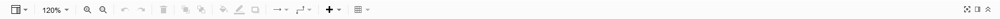

Главная рабочая область обычна разделена на 3 части: диаграмма, список фигур и настройки выделенной фигуры. Список фигур содержит в себе все доступные фигуры для работы, дополнительно можно добавить стандартные библиотеки фигур через меню или через кнопку "More Shapes". Поле настроек фигуры позволяет изменять фигуру, а также элементы внутри неё (текст, соединения, и т.п.). В поле диаграммы кроме самой диаграммы можно увидеть список страниц - диаграмм (в одном файле диаграммы может быть сразу несколько диаграмм).

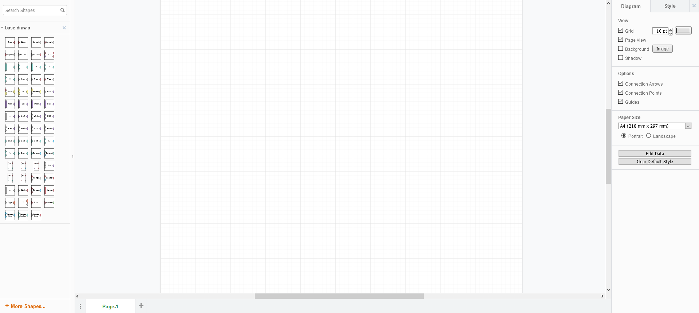

### Добавление библиотек
Библиотека фигур - специальный Xml или Drawio файл, в котором хранится информация о фигурах. Перед их использованием требуется их импортировать (добавить) в рабочую область. Для добавления стандартных библиотек нужно нажать кнопку "More Shapes" и выбрать требуемые библиотеки. В меню "File" есть возможность добавить внешнюю библиотеку фигур. Так как при работе с Sync будет использоваться только внешние библиотеки, добавить их можно несколькими способами через "File" > "Open Library". Наиболее удобные: "Device" (с устройства), "Url" (используя ссылку на библиотеку). 

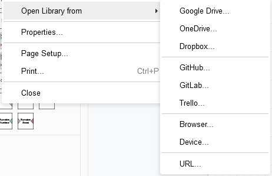

Файлы base.drawio и structure.drawio тоже являются библиотеками. Доступ к ним есть по ссылкам [Base][base_lib] и [Structure][structure_lib]. Их можно быстро добавить без лишних скачиваний через добавление по ссылке (Url).

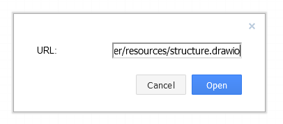

[base_lib]: https://raw.githubusercontent.com/octo-gone/sync-execution/master/resources/base.drawio
[structure_lib]: https://raw.githubusercontent.com/octo-gone/sync-execution/master/resources/structure.drawio

### Построение диграммы
#### Работа с фигурами
Для создание диаграммы нужно добавлять фигуры на рабочую область. Это можно сделать перетащив фигуру из списка на диаграмму. Для этого нужно зажать фигуру, перетащить и отпустить. После добавления фигуры можно взаимодействовать с ней в любом порядке. Продублировать, скопировать или удалить фигуру или сразу несколько можно использовав быстрые клавиши или правую кнопку мыши при выделенных фигурах.

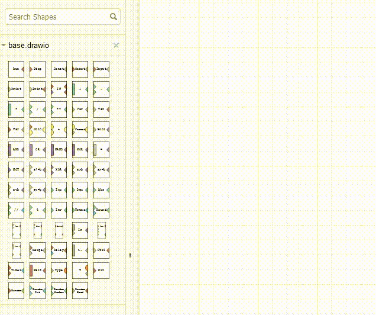

#### Создание связей
Чтоб связать фигуры достаточно навести на точки связи (соединения) на фигуре, нажать и перетащить связь в соединение на другой фигуре (или на той же). Соединения имеют обозначения в виде крестика и обводки.

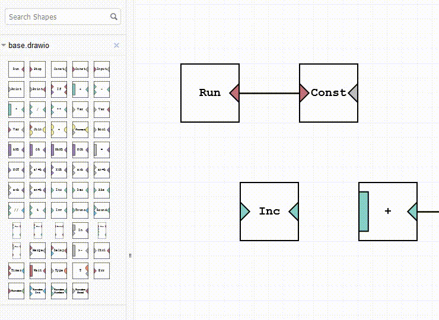

#### Настройка объектов на диаграмме
Большая часть объектов, в том числе и сама диаграмма, имеют настройки и стили. Их можно подстроить под себя для лучшего понимания диаграммы, например изменить цвет связи на цвет типа данных, которые она передает.

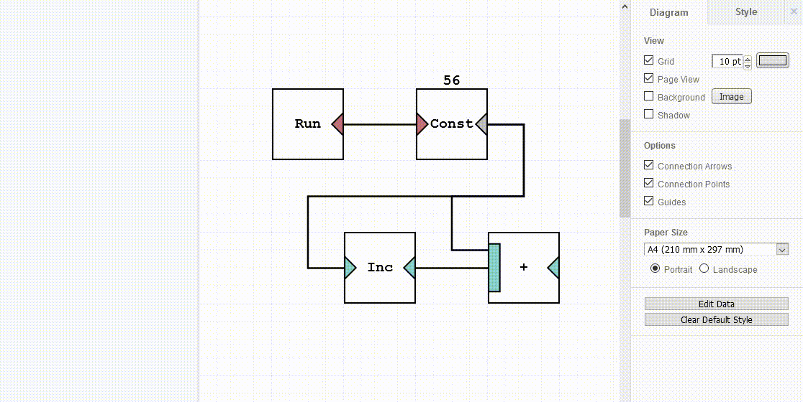

#### Создание библиотеки
Собственная библиотека позволяет сохранять измененные фигуры или целые части диаграммы в отдельном файле. Из него будет просто использовать данные фигуры в будущем. Для создания достаточно выбрать в меню соответстующую кнопку в разделе "File".

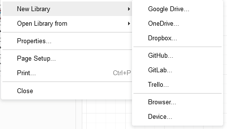

Во время создания и редактирования всегда можно изменить название или добавить элементов. Дополнительно можно сохранить в памяти компьютера, браузера или места, которое было выбрано для библиотеки.

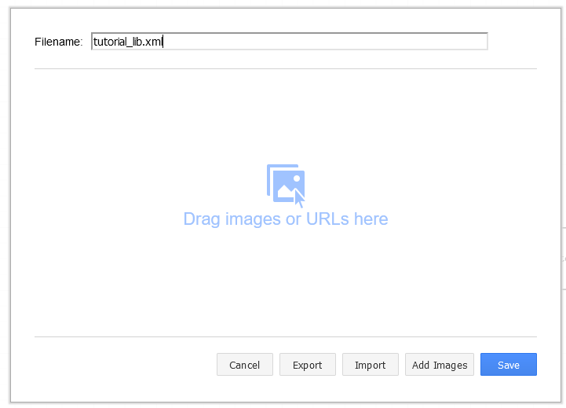

Добавить элемент можно и через редактор, перетащив фигуры в поле библиотеки, можно добавить сразу несколько элементов - выделив их.

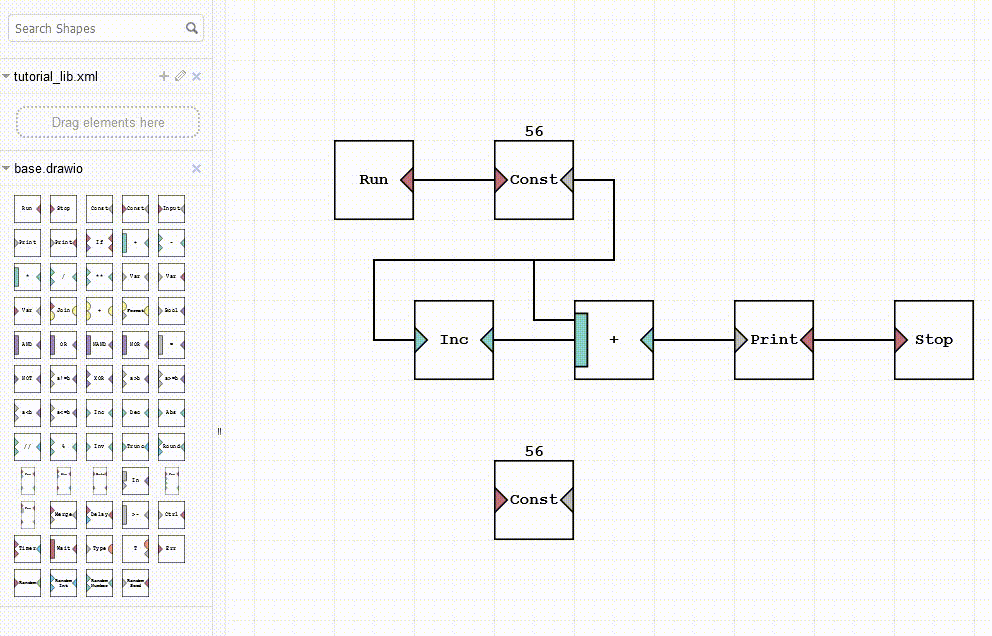

Для редактирования библиотеки нужно нажать соответствующую кнопку (карандаш). После добавления элементов их можно назвать, поменять порядок или удалить.

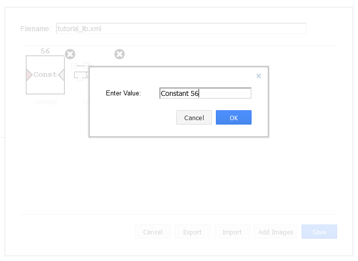

### Дополнительно
При работе с Sync фигурами рекомендуется изменить стиль связей и убрать стрелки, так как они объемные (мешают обзору диаграммы) и не влиют на направление движения сигнала и данных. DRAWIO сохраняет только что созданный стиль как стиль по умолчанию, это значит что можно изменить связь или фигуру в начале и тогда все следующие фигуры и связи получат тот же стиль (если это возможно). Большая часть стандартных фигур имеет стандартные соединения (сверху, снизу, справа, слева и по углам), однако в Sync соединения имеют определяющую роль. Если у фигуры есть одно соединение по центру, то неправильное подключение будет вызвать ошибку.
